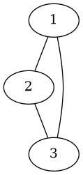
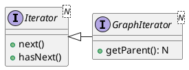

# Graph Iterators
The Iterator interface is not enough for Graph traversal. With a `java.util.Iterator`, you can determine the current item using `next()` and the previous item using context. 

With graphs it is not always possible to determine the parent of any node externally. Consider the following undirected graph:

if `next()` returns node 2, we can't know whether it came from node 1 or 3.

To solve this, we will use the `GraphIterator` interface:

`GraphIterator.getParent()` will return the parent of the last node returned from `next()`. If the returned item has no parent (it's the root), null should be returned instead.

For many iteration types (primarily DFS, BFS and Djikstra's) they work effectively the same with a different time of queue.
* DFS = LIFO
* BFS = FIFO
* Djikstra's = PriorityQueue

As such it makes sense to move the shared functionality into an abstract superclass, `QueueGraphIterator`. To allow the user to get the previously polled node's parent, we will use a queue of node-parent pairs instead of a queue of nodes.

`QueueGraphIterator` will also implement visited node functionality. It will store a set of visited nodes and won't offer or poll nodes that have already been visited. 